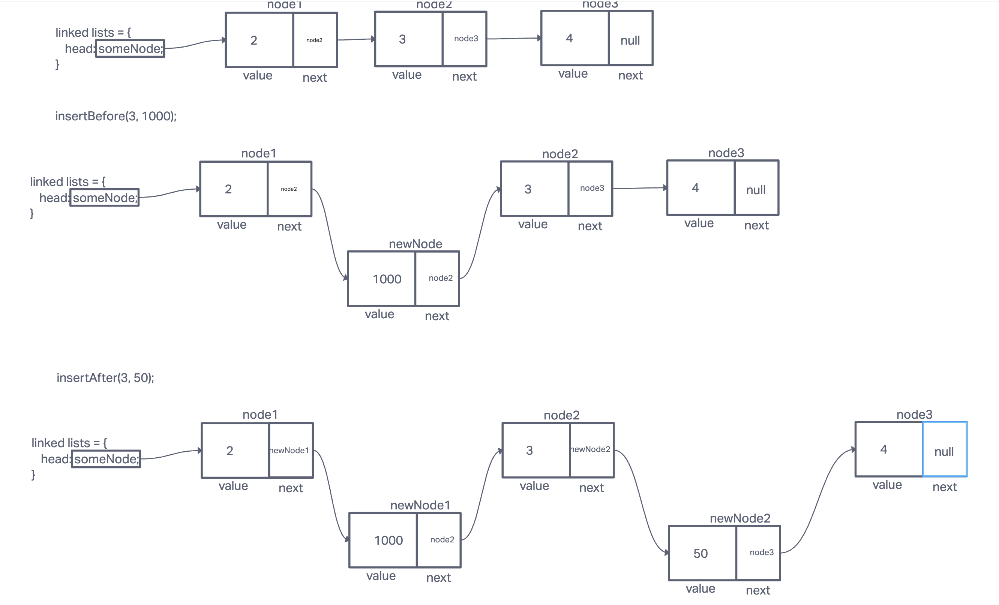
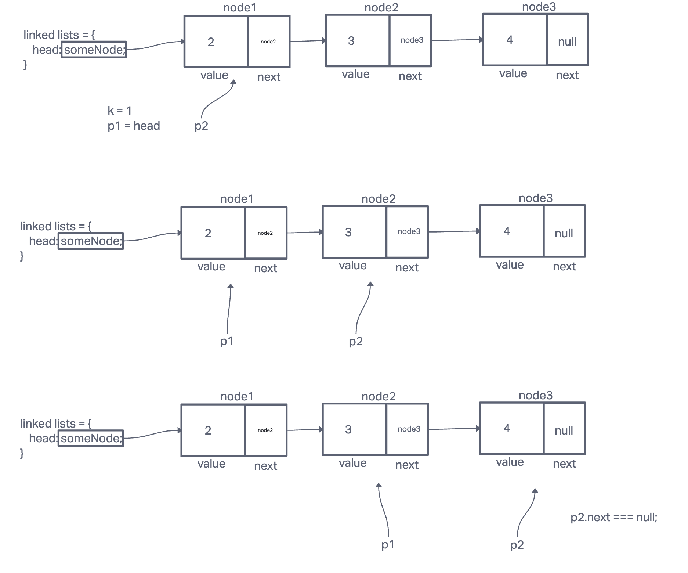

# Linked List

## Description
Implement a linked list

## Whiteboard Process

## Approach & Efficiency

* Implement a Node class that constructs an object that has a value and a next value that points to null or another Node.
* Create a Linked List object that has a head that points to null or another Node.
* When appending to the end of the linked list, use a while loop to start from head and continue down the next pointer until it hits null (end of the list). Then point the last next pointer to a new node with the appended node.
* When checking if a Node exists in the Linked List with a value, traverse through the list and check the value of each node.
* When returning the Linked List in a string format, build a string while traversing through the list.

Appending a node at the end will have O(n) time complexity because traverses nth node once to reach the end. Checking if a node exists in the list and returning a string version of the list will also have O(n).

A linked list has a O(n) for space complexity because each node in a linked list requires a constant amount of space to store the data it contains, as well as a pointer to the next node in the list. The total space required by the linked list is therefore proportional to the number of nodes in the list.

## Solution ##

## Testing ##
