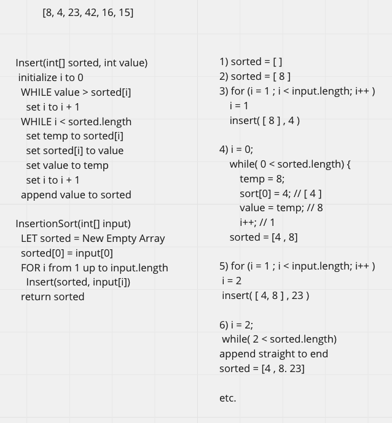

# Insertion Sort

## BigO

Time O(n^2): Worst case scenario (when a given array is reverse ordered), for each element in the input array, a full traversal through the sorted array is needed to reach the end to append the newest number.
Space O(n):  It creates a new sorted array that has the same length as the input array.

## Example Step-through

