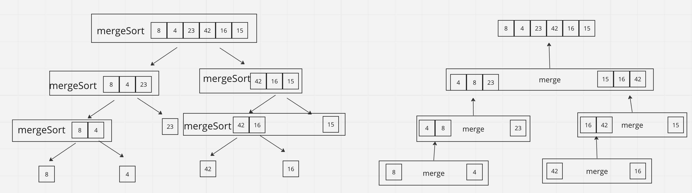

# Merge Sort

## How it Works

1) The function mergeSort takes in an array input
2) If the arr has one element, then it's sorted and returned.
3) Otherwise, the middle index of the array is found.
4) The function then divides the array in half: left contains elements from the start to the mid, while right contains the remaining elements
5) Recursively, the merge function is called on the mergeSort of both left and right to continue splitting the sub-arrays, until the sub-arrays only contain single elements.
6) Once both left and right are single element array, the merge function pushes the smaller element into the resulting array first before the remaining element.
7) If either left or right single element array is missing, the concat of left and right is returned.
8) Finally after all left and right are recursively merged, mergeSort returns the sorted array.

## BigO

Time O(n log n): It splits the array in half recursively until we have single-element sub-arrays, then merges those sub-arrays into sorted order. The recursive splitting is a logarithmic process, while the merging of the arrays is a linear process, resulting in a O(n log n) overall time complexity.
Space O(n): It uses additional memory space to create sub-arrays and combine sorted arrays.

## Example Step-through

