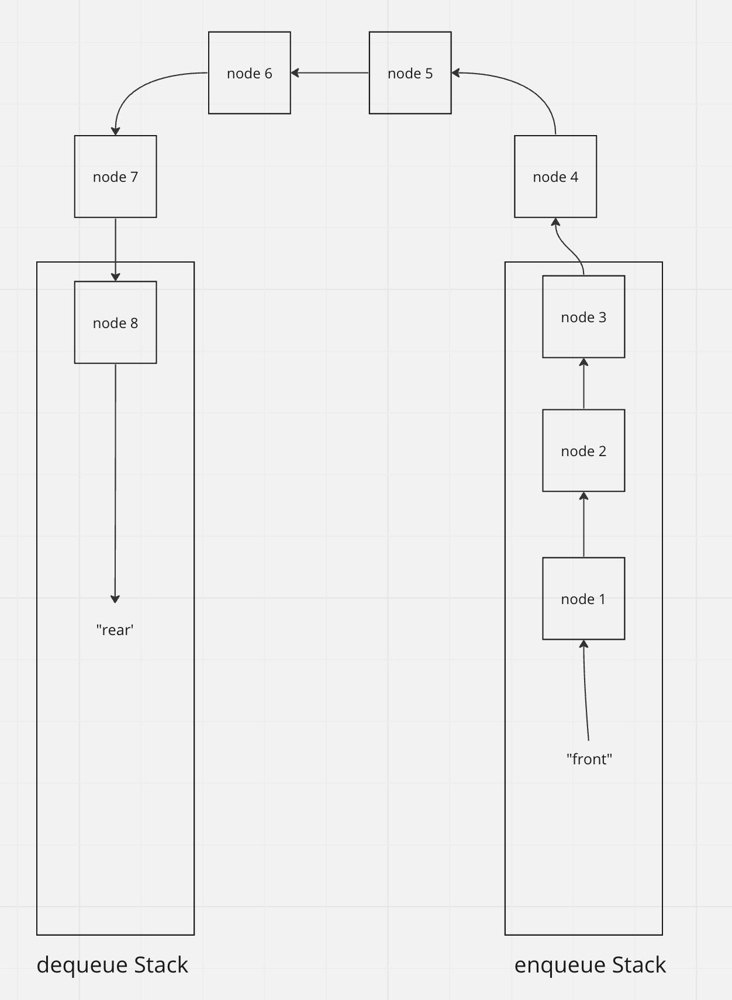

# Stacks and Queue

## Description
Implement a linked list

## Whiteboard Process

## Approach & Efficiency

### Stacks and Queues

* Implement a Node class that constructs an object that has a value and a next value that points to null or another Node.
* Create a Stack object that has a top that points to null or another Node.
* Create a Queue object that has a front and rear that points to null or another Node.

Pushing a node to a stack is O(1) time and space complexity because it only access one node and it's property.

Enqueueing a node to a queue is also O(1) for time and space complexity because it only access one node and it's property as well

### Pseudo Queues

* Implement a pseudo queue, utilizing 2 stacks to keep track (with Stack methods only)
* Create one stack for enqueueing. To enqueue, just use Stack method push() into enqueuStack.
* Create one stack for dequeueing. To dequeue, pop everything from the enqueue stack into the dequeue stack until enqueue stack is empty. The pop() one from the dequeue stack to dequeue.
* Refill the enqueue stack after dequeueing to perserve FIFO ordering of a queue.

This implementation with 2 stacks will mostly be affected by the dequeue stack, which invovles emptying the enqueue stack and refilling it.

Dequeueing a pseudo-queue is O(n) for both time and space, because both stack will grow alongside with the input (utilizing stack as storage). Dequeue invovles popping through the entire enqueue stack.

## Solution ##

## Testing ##

