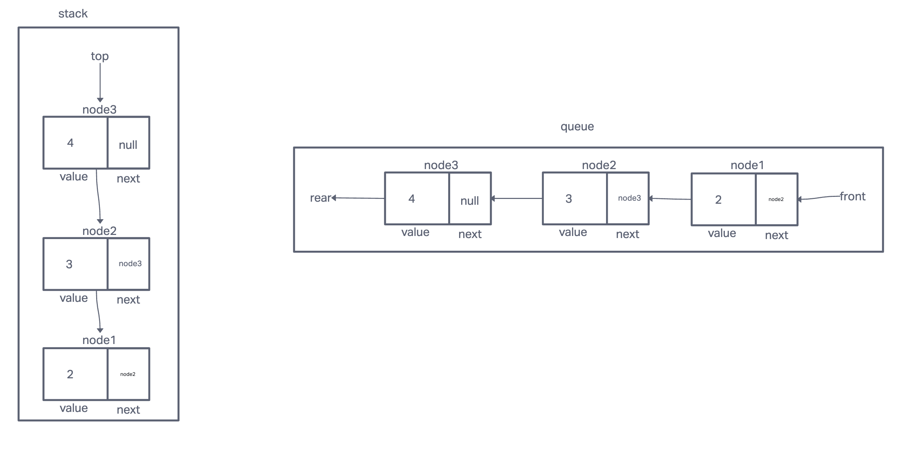

# Stacks and Queue

## Description
Implement a linked list

## Whiteboard Process

## Approach & Efficiency

* Implement a Node class that constructs an object that has a value and a next value that points to null or another Node.
* Create a Stack object that has a top that points to null or another Node.
* Create a Queue object that has a front and rear that points to null or another Node.

Pushing a node to a stack is O(1) time and space complexity because it only access one node and it's property.

Enqueueing a node to a queue is also O(1) for time and space complexity because it only access one node and it's property as well

## Solution ##

## Testing ##

