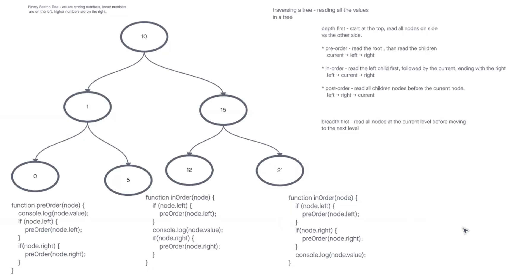

# Trees

## Description
Implement binary tree

## Whiteboard Process

## Approach & Efficiency

### Binary Tree

* Implement a Node class that constructs an object that has a value, has a left, and has a right property.
* Create a Binary Tree object that has a root that points to null or another Node.

The time complexity of adding a node to a binary tree is O(log n) in the average case and O(n) in the worst case, where n is the number of nodes in the tree. The worst-case scenario occurs when the tree is unbalanced and has a height of n, causing the new node to be inserted at the deepest level of the tree, which requires traversing all the nodes.

Space complexity of adding a node to a binary tree is O(1) because it requires a constant amount of space (just one Node object) to store the new node.

## Solution ##

## Testing ##

